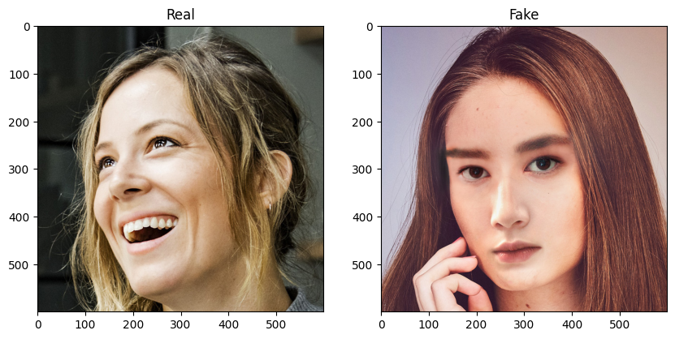

# Detección de Deep Fake con Redes Convolutivas

Se presentan en este repositorio una serie de técnicas para realizar transfer learning y fine tuning a diversos modelos de visión de Pytorch, con el objetivo de clasificar correctamente un dataset de imágenes de rostros reales y generados mediante técnicas de deep fake. Dicho dataset está disponible en [kaggle](https://www.kaggle.com/datasets/ciplab/real-and-fake-face-detection/data) y cuenta con 2041 imágenes, donde las falsas vienen etiquetadas por nivel de dificultad.

<p align="center"></p>

Finalmente, el modelo que mejor nos ha funcionado ha sido el EfficientNet, obteniendo un  ```accuracy``` del 70% para el conjunto de validación, y un 74% para el de test. Para el conjunto de test, además, se obtuvo un ```recall``` del 70%, un ```f1 score``` del 72%. Podemos visualizar los resultados de la clasificación del dataset de prueba en la siguiente matriz de confusión.

<p align="center"></p>

Puede descargarse dicho modelo en el siguiente [enlace](models/efficientnet_ft.pth)
