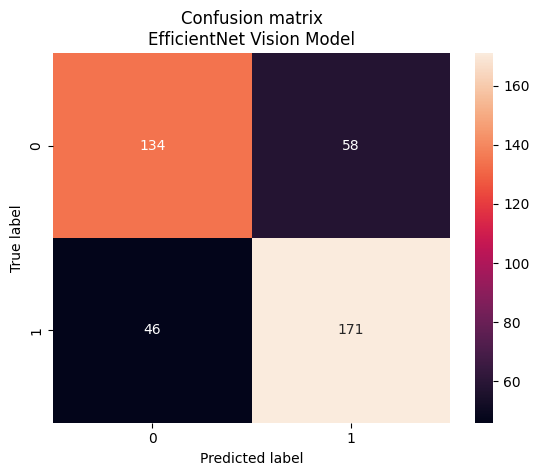

# Detección de Deep Fake con Redes Convolutivas

Este repositorio presenta implementaciones de técnicas de transfer learning y fine tuning en varios modelos de visión de PyTorch. El objetivo principal es clasificar adecuadamente un conjunto de datos que incluye imágenes de rostros reales y generados mediante técnicas de deep fake. El conjunto de datos utilizado está disponible en [Kaggle](https://www.kaggle.com/datasets/ciplab/real-and-fake-face-detection/data) y consta de 2041 imágenes, donde las imágenes generadas falsas están etiquetadas según su nivel de dificultad.

## Modelos Utilizados

### EfficientNet

EfficientNet es un modelo de red neuronal convolucional (CNN) que utiliza un enfoque de escalado compuesto para mejorar simultáneamente la profundidad, el ancho y la resolución del modelo. La implementación de EfficientNet en este repositorio se realiza mediante transfer learning y fine tuning. La fórmula de escalado compuesto es:

Escalado Compuesto = $\alpha^\phi \times \beta^\psi $

Donde:
- $\alpha$: Factor de escala para el ancho.
- $\beta$: Factor de escala para la resolución.
- $\phi$: Parámetro de modelo que controla el tamaño del modelo.

### MNA-Net

MNA-Net es otro modelo de red neuronal que se implementa mediante transfer learning y fine tuning. La arquitectura específica y las fórmulas asociadas se encuentran detalladas en el notebook [mna-net.ipynb].

### MobileNet

MobileNet es una arquitectura de red neuronal diseñada para ejecutarse eficientemente en dispositivos con recursos limitados. La implementación en este repositorio utiliza transfer learning y fine tuning.

### ResNet

ResNet es una arquitectura que introduce bloques residuales para facilitar el entrenamiento de redes profundas. La implementación en este repositorio se realiza mediante transfer learning y fine tuning.

### ResNeXt

ResNeXt es una extensión de ResNet que utiliza un enfoque de "cardinalidad" para mejorar la representación de las características. Se implementa mediante transfer learning y fine tuning.

### VGG16

VGG16 es una arquitectura clásica conocida por su simplicidad y efectividad. La implementación en este repositorio se lleva a cabo mediante transfer learning y fine tuning.

### EfficientNet

El modelo EfficientNet se destaca por su rendimiento, obteniendo un `accuracy` del 70% en el conjunto de validación y un 74% en el conjunto de prueba. Además, se logra un `recall` del 70%, un `f1 score` del 72%. Los resultados se visualizan en la siguiente matriz de confusión:

Puede descargarse dicho modelo en el siguiente [enlace](models/efficientnet_ft.pth)
